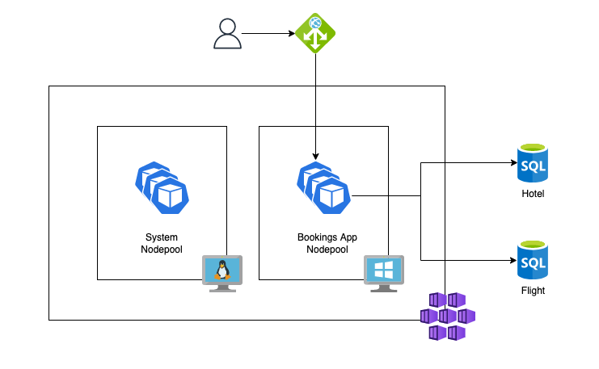

## About

 This repository showcases the use of [Elastic Transactions](https://docs.microsoft.com/en-us/azure/azure-sql/database/elastic-transactions-overview?view=azuresql) in an Azure
 SQL Database, that allows an application to run transactions against several databases without the need to use MSDTC which can be trick, specially with containers.

 The sample app is a .net framework application that runs on Windows nodes on AKS.


### Architecture

This architecture uses Azure Managed Services ([Paas](https://azure.microsoft.com/en-us/resources/cloud-computing-dictionary/what-is-paas/)) exclusively, allowing you to move away from traditional IIS and SQL Server Virtual Machines and the operational burden that comes with it.



### Usage

Create the infrastructure. 

_Take note of terraform apply output, you'll need it later._
```
$ cd terraform/
$ terraform init
$ terraform plan -var 'bookings-app-rg=<resource_group>'
$ terraform apply -var 'bookings-app-rg=<resource_group>' 
$ az aks get-credentials --resource-group <resource_group> --name bookings-app
```

Create each database table from a mssql-tools container:
```
$ kubectl run -it mssql-tools --image=mcr.microsoft.com/mssql-tools --overrides='{"spec": { "nodeSelector": {"kubernetes.io/os": "linux"}}}' -- /bin/bash
```

From another session, copy the scripts to the mssql-tools container:
```
$ cd ../
$ kubectl cp create-flight-table.sql mssql-tools:/tmp
$ kubectl cp create-hotel-table.sql mssql-tools:/tmp
```

Run the scripts:
```
# sqlcmd -S <sql_server_fqdn> -U bookingsapp -d Flight -i /tmp/create-flight-table.sql
# sqlcmd -S <sql_server_fqdn> -U bookingsapp -d Hotel -i /tmp/create-hotel-table.sql
# exit
$ kubectl delete mssql-tools
```

Build the bookings-app container image, set the correct acr url in ```bookings-app.yaml``` and deploy it:
```
$ cd ../sample-app/SampleMSDTC
$ az acr build -r <acr_name> --platform windows --image bookings-app:v1 .
$ kubectl apply -f bookings-app.yaml
```

Get the Ingress IP Address and access it from a web browser.
```
$ kubectl get ingress bookings-app-ingress
```

### Docs

https://docs.microsoft.com/en-us/azure/azure-sql/database/elastic-transactions-overview?view=azuresql

https://azure.microsoft.com/en-us/blog/elastic-database-transactions-with-azure-sql-database/

https://docs.microsoft.com/en-us/dotnet/api/system.transactions?view=net-6.0